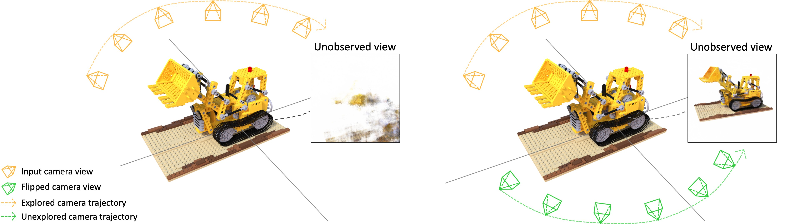
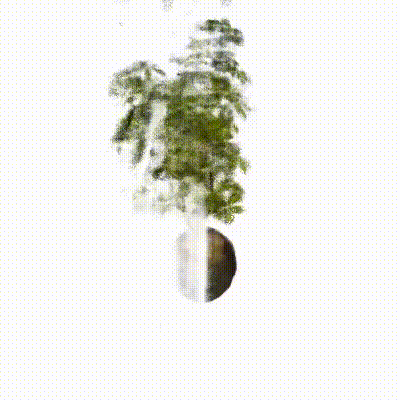

# Just Flip: Flipped Observation Generation and Optimization for Neural Radiance Fields to Cover Unobserved View

Author : Sibeak Lee, Kyeongsu Kang and Hyeonwoo Yu

<br/>

## Overview


(Left) In the conventional approach, the robot merely scans one facet of an object while in motion. This method, however, fails to render a satisfactory result from angles that the robot has yet to explore. (Right) Our method takes actual observations and produces their mirror images. By utilizing both the original and reflected images along with inferred camera positions, the robot learns to understand the 3D space through NeRF, even in unchartered territories. This novel technique allows us to achieve high-quality rendering results from previously unobserved perspectives, even without using images from these angles in our training set.

<br/>

## Video Result

(Left) Original method (Middle) Our method (Right) Upper method





<br/>

## Enviroment setting

This code is developed with Python3 (python3). PyTorch 1.9+ is required. Install the dependencies and activate the environment `just-flip` with

```bash
conda env create --file requirements.yaml
conda activate just-flip
```

<br/>

## Dataset

- #### Official NeRF dataset
    You can find NeRF dataset in the [NeRF](https://www.matthewtancik.com/nerf) link. Download this link and setting dataset like ficus_test folder. We assumed images obtained from a robot's navigation. Thus, set up under the same assumption and conduct the experiment.


- #### Own dataset
    We assumed images obtained from a robot's navigation. You should modify get_image() to read each image sample and set the raw image sizes (self.raw_H, self.raw_W) and focal length (self.focal) according to your camera specs.


<br/>

## Running the code 

#### Generate flip observation and estimate flipped camera pose.
generate_flip_information.py is a function that generates flipped images and estimates the corresponding initial camera pose. Input the appropriate path into the "dir_path" section of the code, and upon execution, a folder containing the flipped images will be created.

```bash
python3 generate_flip_information.py
```


- #### For provided test dataset
    In the generate_flip_information.py script, input the dir_path values as "data/blender/lego_test" and "data/blender/ficus_test", and run each one respectively. Afterwards, execute the provided flip_test.sh to perform both training and evaluation.

    ```bash
    python3 generate_flip_information.py
    chmod +x flip_test.sh
    ./flip_test.sh
    ```


- #### For NeRF dataset 

  ```bash
  # <GROUP> and <NAME> can be set to your likes, while <SCENE> is specific to datasets
  
  python3 train.py --group=<GROUP> --model=barf --yaml=barf_blender --name=<NAME> --data.scene=<SCENE> --barf_c2f=[0.1,0.5]
  python3 evaluate.py --group=<GROUP> --model=barf --yaml=barf_blender --name=<NAME> --data.scene=<SCENE> --data.val_sub= --resume

<br/>

## Codebase structure

The main engine and network architecture in `model/barf.py` inherit those from `model/nerf.py`.
This codebase is structured so that it is easy to understand the actual parts BARF is extending from NeRF.
It is also simple to build your exciting applications upon either BARF or NeRF -- just inherit them again!
This is the same for dataset files (e.g. `data/blender.py`).

To understand the config and command lines, take the below command as an example:
```bash
python3 train.py --group=<GROUP> --model=barf --yaml=barf_blender --name=<NAME> --data.scene=<SCENE> --barf_c2f=[0.1,0.5]
```
This will run `model/barf.py` as the main engine with `options/barf_blender.yaml` as the main config file.
Note that `barf` hierarchically inherits `nerf` (which inherits `base`), making the codebase customizable.  
The complete configuration will be printed upon execution.
To override specific options, add `--<key>=value` or `--<key1>.<key2>=value` (and so on) to the command line. The configuration will be loaded as the variable `opt` throughout the codebase.  
  
Some tips on using and understanding the codebase:
- The computation graph for forward/backprop is stored in `var` throughout the codebase.
- The losses are stored in `loss`. To add a new loss function, just implement it in `compute_loss()` and add its weight to `opt.loss_weight.<name>`. It will automatically be added to the overall loss and logged to Tensorboard.
- If you are using a multi-GPU machine, you can add `--gpu=<gpu_number>` to specify which GPU to use. Multi-GPU training/evaluation is currently not supported.
- To resume from a previous checkpoint, add `--resume=<ITER_NUMBER>`, or just `--resume` to resume from the latest checkpoint.

<br/>

## Citation
If you find our code or paper useful, please citing

    @article{lee2023just,
        title={Just Flip: Flipped Observation Generation and Optimization for Neural Radiance Fields to Cover Unobserved View},
        author={Lee, Minjae and Kang, Kyeongsu and Yu, Hyeonwoo},
        journal={arXiv preprint arXiv:2303.06335},
        year={2023}
    }

