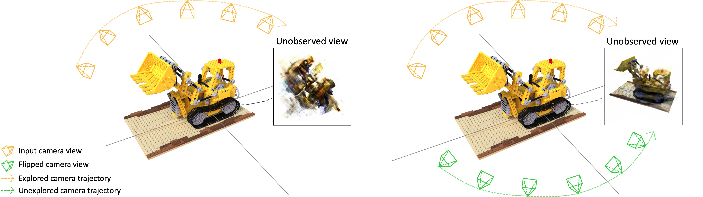

# Just Flip: Flipped Observation Generation and Optimization for Neural Radiance Fields to Cover Unobserved View

<br/>
This is a prototype version and will be updated to a more user-friendly version for future execution. Our data agumentation approach is flippimg observed images, and estimating flipped camera 6DoF poses.

<br/>

## Overview

(Left) the baseline approach where the robot only observes one side of an object while driving. This case does not yield good rendering results in unobserved views that the robot has not explored. (Right) our method generates the flipped observations from the actual observations. The robot exploits both input images and flipped images and estimated camera poses to learn 3D space using NeRF for unexplored regions as well. 

<br/>

## Enviroment setup
Our baseline model is gnerf. So follow the instructions for setting up the environment in the gnerf folder. Our method could be applicable to other models, such as [barf].

[barf]: https://github.com/chenhsuanlin/bundle-adjusting-NeRF

<br/>

## Dataset
We used NeRF synthethic dataset. Download it through the official link [here]. Or you can use your own dataset.

[here]: https://drive.google.com/drive/folders/128yBriW1IG_3NJ5Rp7APSTZsJqdJdfc1

<br/>

## Flipping image
We flipped the image using the flip function in the cv2 module.

 ```
import cv2

img1 = cv2.imread('image.png')
flipped_image = cv2.flip(img1, 1)
cv2.imwrite('flipped_image.png', flipped_image)
 ```

<br/>

## Pose estimation
This code is about estimating flipped camera poses using existing camera coordinates.
```
import numpy as np
import math
import torch

Ax + By + Cz + D = 0      # symmetric plane equation
X_list, Y_list, Z_list    # input camera coordinates
```
<br>

1. Find the optimal sphere using least squares to pass through the input camera pose
 ```
def Find_Optimal_Sphere(X_cordi,Y_cordi,Z_cordi):
    A = np.zeros((len(X_cordi),4))
    A[:,0] = X_cordi*2
    A[:,1] = Y_cordi*2
    A[:,2] = Z_cordi*2
    A[:,3] = 1
    
    f = torch.zeros((len(X_cordi),1))
    f[:,0] = (X_cordi*X_cordi) + (Y_cordi*Y_cordi) + (Z_cordi*Z_cordi)
    C, residules, rank, singval = np.linalg.lstsq(A,f)
    
    radius2 = (C[0]*C[0])+(C[1]*C[1])+(C[2]*C[2])+C[3]
    radius = math.sqrt(radius2)

    return radius, C[0], C[1], C[2]
 ```
<br>


2. Symmetrically transforming the input camera pose with respect to the symmetrical plane.
 ```
def Symmetrically_Transforming(X_cordi,Y_cordi,Z_cordi, A,B,C,D):
    X_flipped_cordi = []
    Y_flipped_cordi = []
    Z_flipped_cordi = []
    
    for i in range(len(X_cordi)):
        X_flipped_cordi.append(X_cordi[i] + 2*A*(-(A*X_cordi[i] + B*Y_cordi[i] + C*Z_cordi[i] + D)/(A*A+B*B+C*C)))
        Y_flipped_cordi.append(Y_cordi[i] + 2*B*(-(A*X_cordi[i] + B*Y_cordi[i] + C*Z_cordi[i] + D)/(A*A+B*B+C*C)))
        Z_flipped_cordi.append(Z_cordi[i] + 2*C*(-(A*X_cordi[i] + B*Y_cordi[i] + C*Z_cordi[i] + D)/(A*A+B*B+C*C)))
    
    X_flipped_cordi = torch.FloatTensor(X_flipped_cordi)
    Y_flipped_cordi = torch.FloatTensor(Y_flipped_cordi)
    Z_flipped_cordi = torch.FloatTensor(Z_flipped_cordi)

    return X_flipped_cordi, Y_flipped_cordi, Z_flipped_cordi
 ```
 <br>

3. Project the symmetrically transformed points onto the optimized sphere.
 ```
def Projection2Sphere(x,y,z, x0,y0,z0,r):
    a = x*x + y*y + z*z
    b = x*x0 + y*y0 + z*z0 
    c = x0*x0 + y0*y0 + z0*z0 -r*r
    
    alpha1 = (-b + math.sqrt(b*b - 4*a*c) )/(2*a)
    alpha2 = (-b - math.sqrt(b*b - 4*a*c) )/(2*a)
    
    if abs(alpha1-1) > abs(alpha2-1):
        alpha = alpha2
    else:
        alpha = alpha1
    
    return alpha*x, alpha*y, alpha*z
 ```
 <br>


4. Estimate the rotation matrix of a flipped camera pose.
 ```
def Get_Transform_Matrics(x,y,z, x0,y0,z0, up):
    # c = torch.FloatTensor([x,y,z])
    c = torch.stack([x,y,z])
    c = c.squeeze()
    at = torch.FloatTensor([x0,y0,z0])
    at = at.squeeze()
    
    torch0 = torch.FloatTensor([0.])
    temp = torch.FloatTensor([0,0,0,1])

    z_axis = (c-at) / torch.norm(c-at)
    x_axis = torch.cross(up, z_axis) / torch.norm(torch.cross(up, z_axis))
    y_axis = torch.cross(z_axis,x_axis)
    
    z = torch.cat([z_axis, torch0])
    x = torch.cat([x_axis, torch0])
    y = torch.cat([y_axis, torch0])
    
    rotation_mat = torch.stack([x, y, z, temp], dim=-1)
    translation_mat = torch.eye(4)
    translation_mat[:3,3] = c 
    transform_mat = torch.matmul(translation_mat, rotation_mat) 
      
    return transform_mat
```
 <br>

Using the functions defined above, we can define a function to estimate flipped camera poses using existing camera coordinates.
```
def Find_Optimal_CameraPose (X_cordi, Y_cordi, Z_cordi):
    flipped_camera_pose_set = []
    
    r, x0, y0, z0 = Find_Optimal_Sphere(X_cordi,Y_cordi,Z_cordi)
    X_flipped_cordi, Y_flipped_cordi, Z_flipped_cordi = Symmetrically_Transforming(X_cordi,Y_cordi,Z_cordi, A,B,C,D)
    
    for i in range(len(X_cordi)):
        X_optim, Y_optim, Z_optim = Projection2Sphere(X_flipped_cordi[i], Y_flipped_cordi[i], Z_flipped_cordi[i], x0,y0,z0,r)
        transform_mat = Get_Transform_Matrics(X_optim.float(), Y_optim.float(), Z_optim.float(), x0,y0,z0, up)
        # print(transform_mat)
        flipped_camera_pose_set.append(transform_mat)
        
    return flipped_camera_pose_set
```
 <br>


## Acknowledgements
This implementation is based on guan-meng's [gnerf].

[gnerf]: https://github.com/quan-meng/gnerf